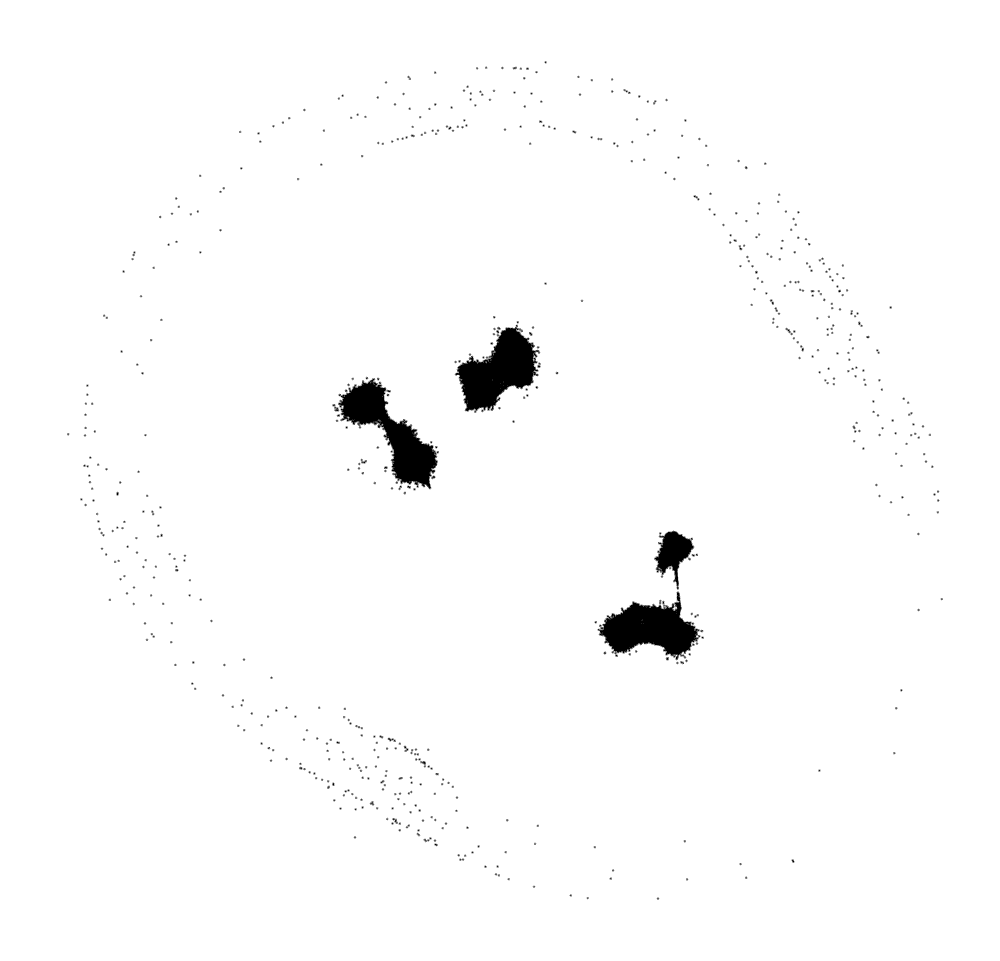

# Stochastic Cluster Embedding (SCE)

The code implements the algorithm in [the SCE paper](https://doi.org/10.1007/s11222-022-10186-z).
```
@article{sce,
    title={Stochastic Cluster Embedding},
    journal={Statistics and Computing},
    year={2023},
    volume={33},
    number={12},
}
```

SCE is a data visualization method which shows the clusters in well-clusterable data. The input is a pairwise similarity matrix, which is often obtained by using Entropic Affinity or K-nearest-neighbor graph.

The SCE program is a standalone excutable which has been tested in Ubuntu. We also provide wrappers in Python and Matlab.

## Prerequisite
Install GSL (GNU Scientific Library) before compilation by
`sudo apt-get install libgsl-dev`

## Compilation
Modify the CUDA architecture in compile.sh to fit your GPU. Here I use Quadro RTX 4000, so it is "-gencode arch=compute_75,code=sm_75". Then run compile.sh.

## Demo usage
For Matlab, see demo.m.
For Python, see demo_vectors.py or demo_similarities.py.

## Demonstration
You can download the data [here](https://ntnu.box.com/s/ar1j9iijjw266xs45jm32w24yadvo21b) to repeat the following demos. Note that some similarity matrices may be non-normalized (SCE will normalize them internally).

### SHUTTLE data set
58,000 data points. [Data source](https://archive.ics.uci.edu/ml/datasets/Statlog+(Shuttle)). [Pre-computed similarity matrix](https://ntnu.box.com/s/8vkjttpvk9ntyjuya031aaje7fjjejwu) (entropic affinity with perplexity 30).
<table cellspacing="0">
  <tr>
    <td> SCE (69 seconds)</td>
    <td> t-SNE </td>
    <td> LargeVis </td>
    <td> UMAP </td>
  </tr>
  <tr>
    <td>  </td>
    <td>  </td>
    <td>  </td>
    <td>  </td>
  </tr>
</table>

### MNIST data set
70,000 data points, [Data source](http://yann.lecun.com/exdb/mnist/), [Pre-computed similarity matrix](https://ntnu.box.com/s/lyl2p0h4ef8o5d9l5ogdryljf9cfaeyc) (10-nearst-neighbor graph).
<table cellspacing="0">
  <tr>
    <td> SCE (47 seconds)</td>
    <td> t-SNE </td>
    <td> LargeVis </td>
    <td> UMAP </td>
  </tr>
  <tr>
    <td>  </td>
    <td>  </td>
    <td>  </td>
    <td>  </td>
  </tr>
</table>

### IJCNN data set
126,701 data points. [Data source, see ijcnn1](https://www.csie.ntu.edu.tw/~cjlin/libsvmtools/datasets/binary.html). [Pre-computed similarity matrix](https://ntnu.box.com/s/rn1cspbivtawwl29t1v4vqsipn1gekaz) (entropic affinity with perplexity 30), where class labels stand for ten engines instead of the original binary.
<table cellspacing="0">
  <tr>
    <td> SCE (75 seconds)</td>
    <td> t-SNE </td>
    <td> LargeVis </td>
    <td> UMAP </td>
  </tr>
  <tr>
    <td>  </td>
    <td>  </td>
    <td>  </td>
    <td>  </td>
  </tr>
</table>

### TOMORADAR data set
120,024 data points. The data was collected via a helicopter-borne microwave profiling radar termed FGI-Tomoradar to investigate the vertical topography
structure of forests. [The original vectorial data (NB! 5.6GB)](https://ntnu.box.com/s/0qnn35tsdiob7cwnicly1v2wwj9x9jbf). [Pre-computed similarity matrix](https://ntnu.box.com/s/ssvwky9brjn0zkbhc6a1zbfsjc85p83a) (50-nearest-neighbor graph).
<table cellspacing="0">
  <tr>
    <td> SCE (660 seconds)</td>
    <td> t-SNE </td>
    <td> LargeVis </td>
    <td> UMAP </td>
  </tr>
  <tr>
    <td>  </td>
    <td>  </td>
    <td>  </td>
    <td>  </td>
  </tr>
</table>

### FLOW-CYTOMETRY data set
1,000,000 data points. [Data source](https://flowrepository.org/id/FR-FCM-ZZ36). [Preprocessed vectorial data](https://ntnu.box.com/s/fgj5a5fnusfdi1wtcyx5cqwqk4llum0b). [Pre-computed similarity matrix](https://ntnu.box.com/s/vaqm0bjo82d7r02s3ej5ws9hp77t5s7w) (15-nearest-neighbor graph).
<table cellspacing="0">
  <tr>
    <td> SCE (7713 seconds)</td>
    <td> t-SNE </td>
    <td> LargeVis </td>
    <td> UMAP </td>
  </tr>
  <tr>
    <td>  </td>
    <td>  </td>
    <td>  </td>
    <td>  </td>
  </tr>
</table>

### HIGGS data set
11,000,000 points. [Data source](https://archive.ics.uci.edu/ml/datasets/HIGGS). [Pre-computed similarity matrix](https://ntnu.box.com/s/7c8cd76rs7jg1otfl0ipri4p97jgfnym) (5-nearest-neighbor graph).
<table cellspacing="0">
  <tr>
    <td> SCE (8969 seconds)</td>
    <td> t-SNE </td>
    <td> LargeVis </td>
    <td> UMAP </td>
  </tr>
  <tr>
    <td>  </td>
    <td>  </td>
    <td>  </td>
    <td>  </td>
  </tr>
</table>

# FAQs
* Q: SCE cannot find clusters for my data. Why?
* A: SCE is designed for well-clustered data. SCE may not identify meaningful clusters if your data is not well-clustered.
<br/>

* Q: The clusters found by SCE do not match the ground truth classes in my data. Why?
* A: SCE is an unsupervised method. There is no guarantee that the clusters must be aligned with the supervised class labels.
<br/>

* Q: The clusters found by SCE looked too small. How can I improve it?
* A: You can tune the parameter alpha to adjust the attraction-repulsion trade-off. By default alpha=0.5. When alpha approaches 0, it behaves similarly to SNE. When alpha approaches 1, the clusters would be more shattered or more compact.

